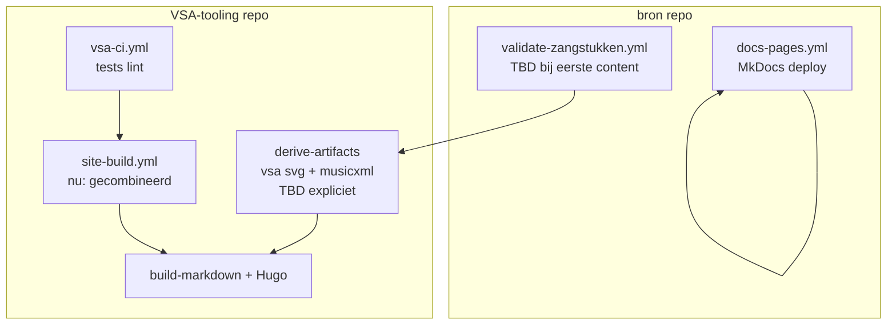

# CI-architectuur (conversie vs. export)

Status: richtlijn juni 2026. Beschrijft **wanneer** workflows splitsen — geen
implementatieverplichting in deze fase.

---

## Doel

Scheiding tussen:

1. **Conversie** — `.vsa` → afgeleide (`.svg`, `.mxl`)
2. **Export / samenstelling** — Markdown includes, Hugo, static site
3. **Documentatie** — MkDocs in `bron` (geen muziek-build)

---

## Aanbeveling: fases, niet per exporttype

**Geen** aparte GitHub workflow per exporttype (`svg`, `coria`, `mxl`) of per
conversietype. Exporttypes zijn passes in **één** build-markdown/Hugo-job.

**Wel** onderscheid op repository en fase:

| Laag              | Repo                   | Workflow (nu)                                                                                           | Richting              |
| ----------------- | ---------------------- | ------------------------------------------------------------------------------------------------------- | --------------------- |
| Documentatie      | `bron`                 | [docs-pages.yml](https://github.com/orthodox-groningen/bron/blob/main/.github/workflows/docs-pages.yml) | Blijft apart          |
| Kwaliteit tooling | VSA-tooling            | `vsa-ci.yml`                                                                                            | Blijft                |
| Conversie         | VSA-tooling / parochie | Deels inline in `site-build`                                                                            | Expliciete derive-job |
| Export + site     | VSA-tooling / parochie | `site-build`, reusable `vsa-render`                                                                     | Eén compose-job       |

---

## bron repository

| Workflow         | Trigger                | Doet                  |
| ---------------- | ---------------------- | --------------------- |
| `docs-pages.yml` | push `main` / branches | MkDocs → GitHub Pages |

**Toekomst** (`validate-zangstukken.yml`):

- `vsa validate` op `zangstukken/**/sources/vsa/*.vsa`
- Optioneel reusable workflow uit VSA-tooling aanroepen
- **Geen** Hugo, geen export

---

## VSA-tooling repository

| Workflow                  | Rol                                                     |
| ------------------------- | ------------------------------------------------------- |
| `vsa-ci.yml`              | Unit tests, lint — geen site                            |
| `site-build.yml`          | Demo-site: content-source → markdown → SVG/MXL → Hugo   |
| `vsa-render-reusable.yml` | Herbruikbaar voor andere repo's (input_dir, assets_dir) |

**Doelarchitectuur:**

1. **Job derive** — `vsa svg` + `vsa musicxml` over content; upload artefacts
2. **Job compose** — download artefacts, `build-markdown`, Hugo deploy

Voordelen: snellere retry bij Hugo-only fouten; duidelijke conversie-log in CI.

---

## Wanneer wél splitsen per conversietype?

Alleen als sterk verschillend:

- Verschillende **triggers** (nightly PDF-batch vs. on-demand SVG)
- Verschillende **resources** (zware jobs)
- **Failure isolation** vereist door organisatie

Op huidige schaal: **één derive-job** met beide commando's is voldoende.

---

## Gerelateerd

- [Inhoudslevenscyclus](../specs/inhoudslevenscyclus.md)
- [Conversiemechanismen](../reference/conversiemechanismen.md)
- [Exportcontracten](../reference/exportcontracten.md)
