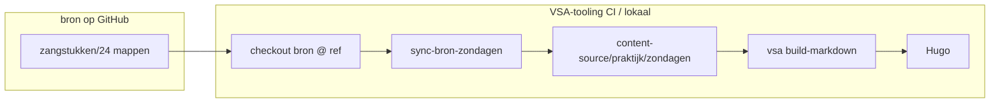

# Migratieplan: zondag-zangstukken naar bron + hugo-demo

Status: plan (juni 2026).  
Einddoel: alle `zondag-toon-<y>.md` (y = 1…8) in VSA-tooling hugo-demo werken, met
bronnen in `orthodox-groningen/bron` en ophalen via GitHub (geen github.io voor assets).

---

## Scope

### Wel in `bron` (24 zangstukken)

| Zangstuk-id | Bronbestand (nu in hugo-demo) | Opmerking |
| ----------- | ----------------------------- | --------- |
| `troparion-zondag-toon-<y>` | `tropaar-zondag-toon-<y>.vsa` | y = 1…8 |
| `kondak-zondag-toon-<y>` | `kondak-zondag-toon-<y>.vsa` | y = 1…8 |
| `troparion-melodie-toon-<y>` | `tropaarmelodie-toon-<y>.jpg` (+ evt. `-<y>a.jpg`) | scan in `sources/scan/` |

Extra scan-varianten (bestaan nu, niet allemaal in zondag-export gebruikt):

| Toon | Extra JPG | Gebruikt in `zondag-toon-<y>.md` |
| ---- | --------- | -------------------------------- |
| 2 | `tropaarmelodie-toon-2a.jpg` | nee (alleen `.jpg`) |
| 4 | `tropaarmelodie-toon-4a.jpg` | nee (alleen `.jpg`; `4a` wél in repo als tweede source) |
| 5 | `tropaarmelodie-toon-5a.jpg` | **ja** (`scale="67%"`) |

**Coria:** alleen `tropaar-zondag-toon-3.coria.html` → bij `troparion-zondag-toon-3`, sibling
naast `.vsa` (conventie export coria).

### Niet in `bron`

- PDF’s (`Zondag - toon <y>.pdf`)
- `tropaar-toon-<y>.md`, `kondak-toon-<y>.md` (losse hugo-pagina’s)
- Afgeleide `.svg` / `.mxl` (build-time)

### Blijft in VSA-tooling (samenstelling / export)

- `examples/hugo-demo/content-source/praktijk/zondagen/zondag-toon-<y>.md` (8 stuks)
- `_index.md`, `export-demo.md` (evalueren na migratie)

---

## Bron-layout per zangstuk (voorbeeld)

### Troparion (VSA)

```
zangstukken/troparion-zondag-toon-3/
  zangstuk.yaml
  sources/vsa/groningen.vsa              ← was tropaar-zondag-toon-3.vsa
  sources/vsa/groningen.coria.html       ← alleen toon 3
```

### Kondak (VSA)

```
zangstukken/kondak-zondag-toon-3/
  zangstuk.yaml
  sources/vsa/groningen.vsa              ← was kondak-zondag-toon-3.vsa
```

### Troparion-melodie (scan)

```
zangstukken/troparion-melodie-toon-5/
  zangstuk.yaml
  sources/scan/koormap-5a.jpg            ← primary voor export toon 5
  sources/scan/koormap-5.jpg             ← optional second source id
```

**Naamgeving bronbestanden in repo:** stabiel (`groningen.vsa`, `koormap.jpg`); liturgische
identiteit zit in `zangstuk.yaml` (`id`, `tone`, `title`).

---

## Metadata

### `zangstuk.yaml` (leidend in bron)

Minimaal per zangstuk:

- `id` = mapnaam
- `title`, `occasion_type: zondag-cyclus`, `tone: <y>`
- `sources[]` met `id: groningen` (of `koormap-scan`) + `file:` + `copyright_status: vrij`
- `reference:` / `note:` verwijzing koormap Groningen waar zinvol

### VSA-frontmatter (in `.vsa`)

Behoud/aanvullen uit hugo-demo (titels, `tone`, tempo, `bron: koormap Groningen`).
Overlap met yaml is oké; buiten bron wint yaml.

---

## Integratie VSA-tooling (ophalen via GitHub)

`:::include` ondersteunt **lokale paden**. Bronbestanden komen binnen via **build-time materialisatie**
(voorkeur fase 1), later optioneel **zangstuk-id-resolver**.



### Fase B1 — Sync-script (minimale code)

Nieuw in VSA-tooling: `scripts/sync_bron_zondagen.py` (naam voorbeeld)

- Input: pad naar bron-checkout (`--bron-root`)
- Output: `examples/hugo-demo/content-source/praktijk/zondagen/_from-bron/` of direct
  naast `.md` met **vaste namen** die `zondag-toon-<y>.md` al gebruikt:
  - `tropaar-zondag-toon-<y>.vsa`
  - `kondak-zondag-toon-<y>.vsa`
  - `tropaarmelodie-toon-<y>.jpg` / `-5a.jpg` / coria sibling
- Mapping uit `zangstuk.yaml` + conventie `sources/vsa/groningen.vsa`

`zondag-toon-<y>.md` **hoeft dan niet** meteen nieuwe syntax; alleen `.gitignore` op
materialized copies of sync vóór elke build.

### Fase B2 — CI

In `site-build.yml` / lokaal testen:

1. `actions/checkout` VSA-tooling
2. `actions/checkout` bron → `vendor/bron` (path)
3. `python scripts/sync_bron_zondagen.py --bron-root vendor/bron`
4. `vsa validate` + `build-markdown` + `hugo` (zoals nu)

Pin bron op `main` of tag; later semver/ref parameter.

### Fase B3 — Opschonen hugo-demo

Verwijder uit git (niet meer dupliceren):

- `tropaar-zondag-toon-*.vsa`, `kondak-zondag-toon-*.vsa`
- `tropaarmelodie-*.jpg`, `*.coria.html`

Behoud alleen `.md` samenstellingen + sync-output (gitignored) of altijd sync in CI.

### Fase C — Optioneel later

- `:::include svg "zangstuk:troparion-zondag-toon-3"` zonder platte kopie
- `composities/zondag-toon-<y>.yaml` in bron (nu: md in VSA-tooling volstaat)

---

## Uitvoeringsvolgorde

| Fase | Wat | Repo | Done when |
| ---- | --- | ---- | --------- |
| **0** | Dit plan akkoord | bron | — |
| **1a** | Pilot **toon 3**: 3 zangstuk-mappen + yaml + validate | bron | `vsa validate` groen |
| **1b** | Overige 21 zangstukken (batch 1–2,4–8) | bron | 24 mappen compleet |
| **2a** | Sync-script + lokale test toon 3 | VSA-tooling | `zondag-toon-3.md` build ok |
| **2b** | Alle 8 `zondag-toon-<y>.md` + CI checkout bron | VSA-tooling | demo-site groen |
| **3** | Duplicaten uit content-source verwijderen | VSA-tooling | alleen md + _index |
| **4** | `validate-zangstukken.yml` in bron | bron | CI op push |

---

## Acceptatie (Definition of Done)

- [ ] 24× `zangstukken/<id>/zangstuk.yaml` + bronbestanden in `bron`
- [ ] `vsa validate` op alle `.vsa` in bron (lokaal + CI)
- [ ] Sync vanuit bron-checkout; geen handmatige kopie van `.vsa`/`.jpg` in hugo-demo git
- [ ] 8 pagina’s `zondag-toon-<y>` renderen: tropaar svg+coria, kondak svg+coria, melodie-jpg
- [ ] Coria HTML werkt voor toon 3; overige tonen coria via MXL-fallback (zoals nu)
- [ ] PDF’s en losse tropaar/kondak-md **niet** in bron

---

## Risico’s

| Risico | Mitigatie |
| ------ | --------- |
| Coria alleen toon 3 | Documenteer; MXL genereren in CI waar gewenst |
| Meerdere JPG per melodie-toon | Primary source in yaml; sync kiest juiste file per `zondag-toon-<y>.md` |
| Cross-repo Cursor-frictie | `bron` in multi-root workspace of aparte commits |
| Sync vs. resolver | Start sync; refactor naar zangstuk-id als include-syntax stabiel is |

---

## Gerelateerd

- [Repo-structuur](../specs/repo-structuur.md)
- [Zangstuk-formaat](../specs/zangstuk-formaat.md)
- [Zangstuk toevoegen](../manuals/zangstuk-toevoegen.md)
- VSA-tooling: `docs/plan-samenstelling-uitgaveprofielen.md`, Spoor B exporttypes
