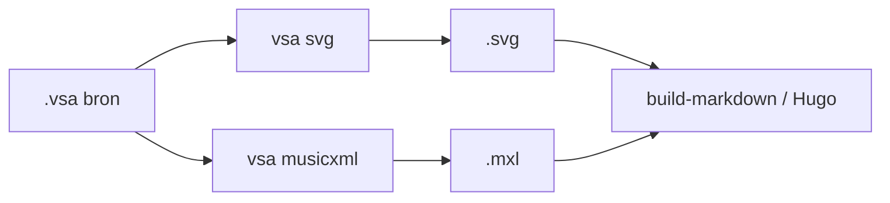

# Conversiemechanismen

Referentie voor **conversiemechanismen**: geautomatiseerde tools die brondocumenten
omzetten naar **afgeleide** bestanden (`.svg`, `.mxl`, …).

Conversie is **geen** export: conversie verandert het formaat; export bepaalt hoe
afgeleide in een samenstelling verschijnen ([Exportcontracten](exportcontracten.md)).

Implementatie:
[VSA-tooling](https://github.com/orthodox-groningen/VSA-tooling).

Afgeleide output hoort **niet** in de `bron`-repository (zie `.gitignore`).

---

## Conversie vs. export

| Laag      | Vraag                                   | Voorbeeld                   |
| --------- | --------------------------------------- | --------------------------- |
| Conversie | Wat is de afgeleide en hoe maak ik die? | `vsa svg lied.vsa lied.svg` |
| Export    | Hoe toon ik die in een samenstelling?   | `:::include svg "lied.vsa"` |

---

## Geregistreerde mechanismen

| Mechanisme       | Contract                                            | Output               |
| ---------------- | --------------------------------------------------- | -------------------- |
| **vsa svg**      | [conversie-vsa-svg](conversie-vsa-svg.md)           | `.svg`               |
| **vsa musicxml** | [conversie-vsa-musicxml](conversie-vsa-musicxml.md) | `.mxl` / `.musicxml` |

---

## Pipeline-volgorde (doel)

**Huidige stand:** SVG-conversie draait deels **inline** tijdens `build-markdown`;
MXL wordt handmatig of in site-build gegenereerd. Expliciete conversiestap vóór
export is gepland — zie [CI-architectuur](../plans/ci-architectuur.md).

---

## Toekomstige conversies

| Mechanisme | Input   | Output | Status                                        |
| ---------- | ------- | ------ | --------------------------------------------- |
| Scan → VSA | PDF/png | `.vsa` | Niet geautomatiseerd; handmatige transcriptie |
| Audio      | —       | —      | Nog niet gedefinieerd                         |

Nieuwe mechanismen krijgen een volledig contract (zelfde diepte als bestaande)
**vóór** opname in CI.

---

## Gerelateerd

- [Exportcontracten](exportcontracten.md)
- [Inhoudslevenscyclus](../specs/inhoudslevenscyclus.md) Deel 2
- [Schrijfconventies](../specs/schrijfconventies.md)
