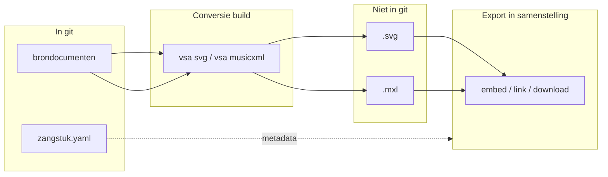

# Inhoudslevenscyclus

Status: specificatie v1 (juni 2026). Beschrijft de keten van brondocumenten via
conversie naar export in samenstellingen.

---

## Overzicht

Drie lagen — **niet** door elkaar halen:

| Laag                | Wat                                      | Waar gedocumenteerd                                                  |
| ------------------- | ---------------------------------------- | -------------------------------------------------------------------- |
| **Bron + metadata** | Bestanden in git + `zangstuk.yaml`       | Deel 1; [Zangstuk-formaat](zangstuk-formaat.md)                      |
| **Conversie**       | Tools met vaste input/output → afgeleide | Deel 2; [Conversiemechanismen](../reference/conversiemechanismen.md) |
| **Export**          | Hoe afgeleide in een uitgave verschijnen | Deel 3; [Exportcontracten](../reference/exportcontracten.md)         |



---

## Deel 1 — Brondocumenten en `zangstuk.yaml`

### Plaatsing

```
zangstukken/<zangstuk-id>/
  zangstuk.yaml
  sources/
    vsa/<bron-id>.vsa
    scan/<bestand>.pdf
    musicxml/<bron-id>.musicxml    # alleen als zelfstandige bron
```

Zie [Repo-structuur](repo-structuur.md) voor naamgeving en cross-references naar
gedeelde scans.

### Brontypes

| Type               | Submap              | In git | Opmerking                                           |
| ------------------ | ------------------- | ------ | --------------------------------------------------- |
| VSA-notatie        | `sources/vsa/`      | ja     | Primaire tekstbron voor conversie                   |
| Scan (PDF, raster) | `sources/scan/`     | ja     | Niet splitsen bij meerdere zangstukken op één blad  |
| MusicXML als bron  | `sources/musicxml/` | ja     | Alleen indien niet uit VSA in deze repo gegenereerd |

### Validatie brondocumenten

| Brontype                    | Check                           | Tool / moment                           |
| --------------------------- | ------------------------------- | --------------------------------------- |
| `.vsa`                      | Parse + semantische validatie   | `vsa validate` (CI, lokaal vóór commit) |
| `.pdf`                      | Geldig PDF, minstens één pagina | CI-script (toekomst); visuele controle  |
| `.png`/`.jpg`               | Geldig raster                   | CI-script (toekomst)                    |
| `.musicxml`/`.mxl` als bron | Well-formed XML                 | toekomst                                |

Details: [Brontypes en validatie](../reference/brontypes-validatie.md).

### `zangstuk.yaml` — tot stand komen

- **Handmatig:** beheerder schrijft of wijzigt YAML (zie [Zangstuk toevoegen](../manuals/zangstuk-toevoegen.md)).
- **Geautomatiseerd (toekomst):** geen volledige auto-generatie; wel lint/CI die schema,
  paden en cross-references controleert.

**Voorrangsregel:** binnen deze repository is `zangstuk.yaml` leidend voor metadata
die ook in VSA-frontmatter kan staan (`title`, auteurschap, taal, toon). Frontmatter
in `.vsa` is bedoeld voor gebruik *buiten* deze repo (bijv. losse export met VSA-tooling).

### Validatie en compleetheid metadata

Minimaal (handmatig of CI):

- `id` gelijk aan mapnaam; `title` aanwezig
- Minstens één `sources`-entry
- Per source: **exact één** van `file:` / `access:` / `status: nog-niet-getranscribeerd`
- Elk `file:`-pad bestaat relatief aan de zangstuk-map
- `based_on` verwijst naar bestaande source-id binnen hetzelfde zangstuk
- Liturgische velden waar van toepassing (`occasion_type`, `tone`, …)
- `copyright_status: copyrighted` ⇒ geen `file:`; wel `access:`

### Workflow invoeren / updaten

| Actie              | Handleiding                                                  |
| ------------------ | ------------------------------------------------------------ |
| Nieuw zangstuk     | [Zangstuk toevoegen](../manuals/zangstuk-toevoegen.md)       |
| Nieuwe bronvariant | [Bronvariant toevoegen](../manuals/bronvariant-toevoegen.md) |
| Copyright / access | [Copyright en access](../manuals/copyright-access.md)        |

---

## Deel 2 — Conversiemechanismen

Conversie verandert **formaat** (bron → afgeleide). Afgeleide worden **niet** in git
bewaard; ze worden in build-workflows gegenereerd.

Geregistreerde mechanismen:

- [Conversiemechanismen — overzicht](../reference/conversiemechanismen.md)
- [Conversie vsa svg](../reference/conversie-vsa-svg.md)
- [Conversie vsa musicxml](../reference/conversie-vsa-musicxml.md)

**Trigger (doel):** na merge naar `main` of bij parochie-build wanneer een zangstuk
wordt opgenomen in een samenstelling.

**Huidige stand:** conversie draait deels inline in VSA-tooling `build-markdown`;
expliciete vooraf-build voor alle afgeleide is gepland — zie
[CI-architectuur](../plans/ci-architectuur.md).

---

## Deel 3 — Exportmechanismen

Export bepaalt **hoe** een afgeleide (of handmatige sibling) in een samenstelling
wordt ontsloten — embedden, Coria-link, download.

Exportcontracten:

- [Exportcontracten — overzicht](../reference/exportcontracten.md)
- [Exporttype svg](../reference/exporttype-svg.md)
- [Exporttype coria](../reference/exporttype-coria.md)
- [Exporttype mxl](../reference/exporttype-mxl.md)

Authoring-syntax in parochie-/samenstelling-repositories (VSA-tooling):

```markdown
:::include svg "melodie.vsa" alt="…":::
:::include coria "melodie.vsa" label="Oefenen in Coria":::
:::include mxl "melodie.vsa" label="Download MusicXML":::
```

Dat zijn **exporttypes**, geen conversie-commando's.

### Uitgaveprofielen

| Profiel           | Conversie nodig                | Export / layout                            |
| ----------------- | ------------------------------ | ------------------------------------------ |
| Afdruk / download | `vsa svg`                      | embed svg, `keep-together`, `@media print` |
| Online            | `vsa svg`, evt. `vsa musicxml` | embed svg, Coria, `web-only`               |
| Bewerking         | `vsa musicxml`                 | mxl-download                               |

Profielen zijn geen aparte pipelines: één samenstelling, conditionele export en CSS.

---

## Gerelateerde documentatie

- [Repo-structuur](repo-structuur.md)
- [Zangstuk-formaat](zangstuk-formaat.md)
- [VSA-tooling — document samenstellen](https://github.com/orthodox-groningen/VSA-tooling/blob/main/docs/spec-vsa-document-samenstellen.md)
